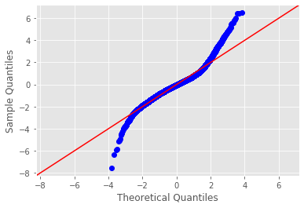

# Module 2 Final Project

## Introduction

We will be exploring the King County House Sale dataset with a multivariable linear regression to predict the sale price of homes in the area. Hopefully, we'll be able to leverage the insights in this analysis to determing the most important features of a home before we open our own construction business.

Key questions:

- Which features of a home have the greatest impact on home price?

- Which areas of King County should we consider building in?

- How can we improve the potential sale price of a home?

## The Dataset

The King County House Sales dataset is made up of the following columns:

ID
Date
Price
bedrooms
bathrooms
sqrft_living (square footage of entire living space)
sqft_lot (swaure footage of plot of land)
floors
waterfront
view
condition
grade
sqft_above (square footage above the first floor)
sqft_basement (square footage of the basement)
yr_built
yr_renovated
zipcode
lat
long
sqft_living15 (square footage of living space in nearest 15 homes)
sqft_lot15 (square footage of lots in nearest 15 homes)

## Approach

1. Cleaning the data. Removing outliers and unnecessary columns.
2. Exploring the data to prepare for modeling. Bucketing variables as categorical or numerical and creatign dummy variables.
3. Creation of baseline model.
4. Refining the model.
5. Interpretations of and recommmendations based on the final model.

## Baseline Model

For this project, the baseline model was created immmediately after cleaning and creating dummy variables. Our inital R^2 is 0.841. However, multiple features have p-values greater than 0.05. Furthermore, our residuals are skewed (see below) and the difference in RMSEs between our test and train sets is very high (> 8.2 MM). 

## Final Model

## Conclusions
The process for this project is identical to the process you followed for your module 1 project. We specified it again below as a refresher.
(Note: On-campus students may have different processes, please speak with your instructor)

